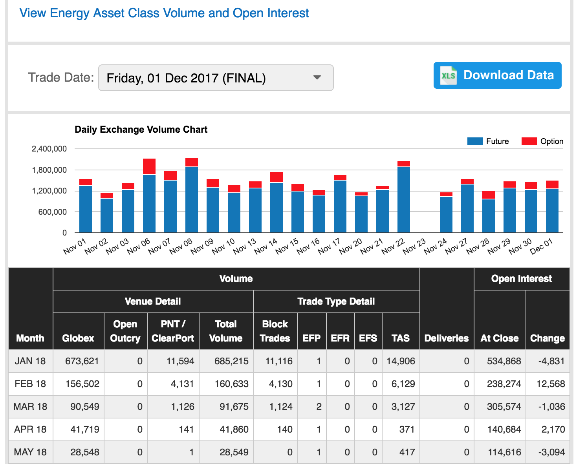
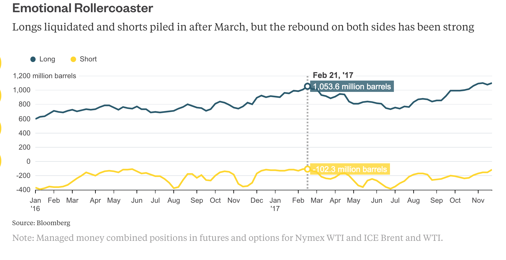
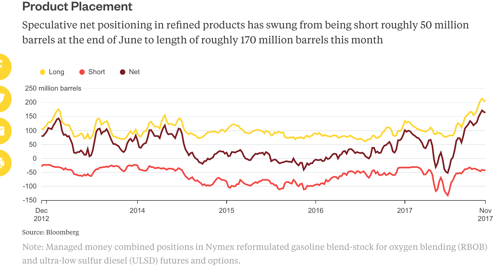
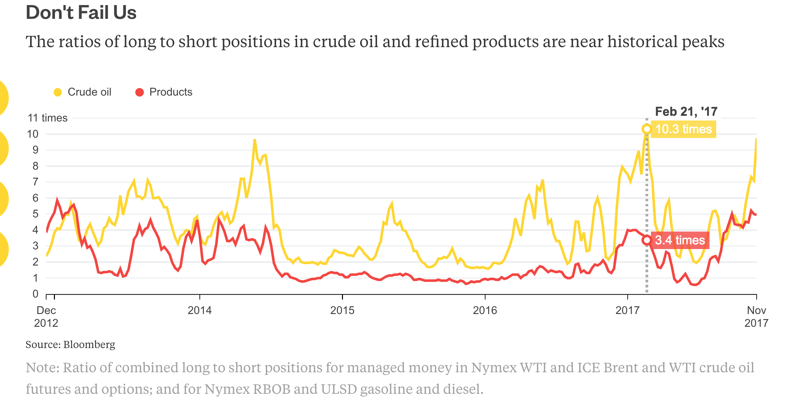

###  CL OPen Interest and daily volume and historical trends in Net LONG, SHORT positions of Managed futures .


### 1/  Genneral daily Volume and Open Interest
```
 - on Nymex CL current month contract 'open interest' and daily volume shown below
 - WTI  daily volume for FUTUES around 1.2 Million , Future Options 250,000 ( Options are 10% of Futures vol)
 - Open interest is how many contracts are LEFT at the end of the day (with out CLOSING Contracts )
 ```
 
[CL Daily Volume and Open interest](http://www.cmegroup.com/trading/energy/crude-oil/light-sweet-crude_quotes_volume_voi.html?marginsTab=SOM)


------------------------------------------------------------------------

####  2/ The Billion Barrels That [Make or Break the Oil Market](https://www.bloomberg.com/gadfly/articles/2017-12-04/crude-oil-net-long-positions-near-record-1-billion-barrels)

Speculative inflows have been a central feature of the rally in oil prices since the summer. The whipsaw in sentiment, 
fueled by a mixture of OPEC recommitting to supply cuts and the resurfacing of geopolitical concerns, is striking. 


Break down the long and short positions for managed money and you can see the swing between elation, despair and elation again, all in the space of this year:

```
 - Each contract is 1000 Barrels, so 1 Billion barrels is 1 Million future contracts 
```





