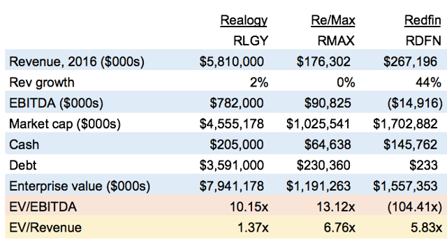

#### IPO Stocks and how the stock price flucuated over next 12 months .

1/ How Zillow Group Inc. Finds Success [as a Modern Day Real Estate Conglomerate](https://www.fool.com/investing/2017/02/01/how-zillow-group-inc-finds-success-as-a-modern-day.aspx)  <br> &nbsp;&nbsp;
```
a) Jul 2011 on IPO day Market cap is $930 MM
b) Jul 2017 Market cap $8.3 Billion : With a portfolio of nine different brands ( acquistions), each plays a role in 
          contributing to the company's growth
          
c) By aciqusitons to become humongus, Zillow is like 'Price Line group' 
  ( price line group market cap is $100 Billion : grew with big acquistions hotels.com ( EU makret leader), Kayak  etc.. )

d) Zillow Business Model is Advertisements from Agents, Listing offices etc.. on 9 different web sites 
e) RedFin business Model:  deep discount Home Listing Fees 4.5% for SELLing , 1.5% for BUYing ( compared to 6% SELL, 4% BUY with tradtional agaents )

g) 
```
Redfin IPO Too Hot: Caution Advised - [Redfin should be compared to public companies RLGY RMAX ](https://seekingalpha.com/article/4092906-redfin-ipo-hot-caution-advised)
```
RedFin business model ( discount HOme listing commision ) is comparable to  RLGY and RMAX , but not comparable to Zillow 
which is 'Ad company' for Agents, Listing Offices etc. using it 9 web sites .

Below is the Refinf Operating Comparables ..

```


 

```
Zillow's business model
Zillow Group is a technology-powered residential real estate advertising company. Unlike Redfin it does not employ 
local real estate agents. Instead, it looks upon real estate agents, mortgage brokers, and contractors as customers
who will advertise on its various branded sites.

From a business model perspective, these two companies are very different. 
Redfin is an operating real estate brokerage company that is also interested in title insurance and mortgages and Zillow 
is primarily an advertising company. 

Both are using technology and consumer access to the internet to disrupt the traditional residential real estate industry.

2/ Redfin
-----------
Redfin's competition is local real estate companies doing business all over America. It is currently located in over 80
different markets around the country and employed almost 800 lead agents as of the end of 2016.

Reduced commission. 
----------
In a standard transaction of a house sale, there is a total of 6% commissionwith half going to the seller's agent 
and the other 3% to the buyer's agent. 

Redfin charges on average 1.5% for the listing, the seller then pays the other 3% to the buying office, 
constituting a saving of 1.5%. 

Redfin rebates buyers, in states where rebates are allowed, on average about $3,500 when the buyer uses a Redfin agent.
```

3/ Zillo Vs. Red Fin [comparision here](https://www.geekwire.com/2017/redfin-vs-zillow-comparing-two-real-estate-powerhouses-time-ipos/)
```
Zillow
--------------------
Founded: 2004
IPO date: July 19, 2011
Shares offered: 3,462,000

Offering price: $20 per share
Opening price: $60 per share
First day closing price: $35.77, up 79 percent

Valuation: $962 million (at close following IPO)
Cash raised in IPO: $69 million

Employees at time of IPO filing: 275
Monthly unique visitors at time of IPO: 22 million

Q1 2011 revenue: $11.2 million
Q1 2011 net loss: $826,000

RED Fin
--------------------
Founded: 2002
IPO date: July 27, 2017
Shares offered: 9,231,000

Offering price: $15
Opening price: $19.56
First day closing price: TBD

Valuation: $1.2 billion (At time of pricing IPO)
Cash raised in IPO: $138 million

Employees at time of IPO filing: 2,193
Monthly unique visitors at time of IPO: 20 million

Q1 2017 revenue: $59.8 million
Q1 2017 net loss: $28 million

```

