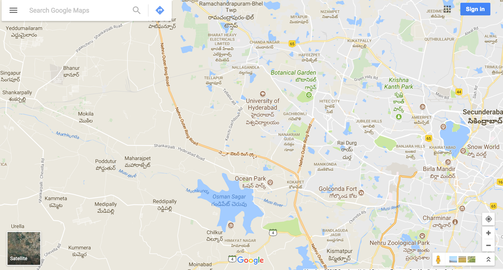

map showing MOKILA ( Subhishi  developers between  CBIT Engg. collage and SHANKAR PALLY )

 
 
 google map url: https://www.google.com/maps/@17.4261213,78.3142789,12.01z
 
```
Mist Homes
by Subishi Developers

Mokilaroad Located along Shankarpally Road, Mokila is a suburb in the Rangareddy district. &nbsp;It is a peaceful belt 
of lush greenery, about 39 kilometres north of Hyderabad. The region is bounded by Mandal (...Nearest School2.90 km
Primary School Poddatoor

This suburb in the Rangareddy district is situated at a distance of about 39 kilometeres north of Hyderabad. 
Its proximity to the financial district of Gachibowli and IT hubs at Kokapet has favored the growth of real estate. 
The average apartment price in this area is Rs. 1800 per sq ft.


know more about Mokila,  Hyderabad
```
 
