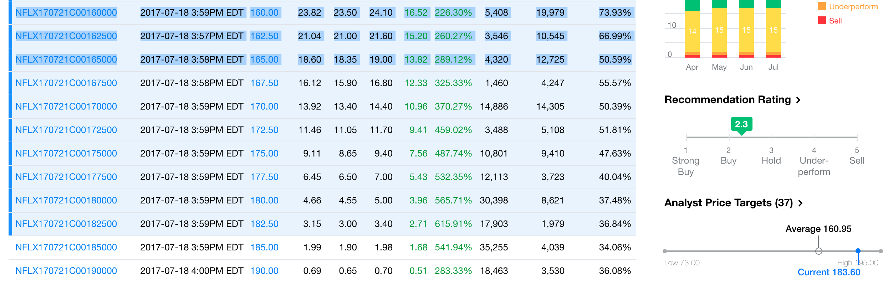
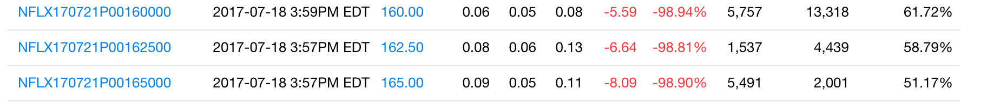

#### Buying both CALL and PUT for High Volatality stocks on major EVENT days ( Earnings, Product releases, Court Verdicts etc.. )

Case in Point : [NETFLIX on earnings Day](https://finance.yahoo.com/quote/NFLX/options?p=NFLX)
```

1) on MONDAY 7/17/17  ( Buy PUT + Buy CALL )
  total price : $8 + $5.60 =  $13.50 
  1 contract is 100 OPTIONS -> $1350 
  
2) On TUESDAY 7/18/17 the COMBO worth ( great quarter, STOCK up by 13.5% $21 ) 
  $2350 = CALLS Worth  
      $5 = PUTS Worth 
 
   Profit :  Sale Price - Cost
             $1000  = $2350 - $1350 
            
   Profit % = ( $1000 / 1350 ) * 100 = 74% ( that is in ONE day .. ) if you annualize       
            
          
  
3) 7/17/17 Monday CALL $160 Strike price is $8.00 
 on Tuesday it increased by $16.50 so trading at $23.50 as shown below ( stock incresed $21 on Tuesday )

NFLX170721C00160000	2017-07-18 3:59PM EDT	160.00	23.82	23.50	24.10	16.52	226.30%	5,408	19,979	73.93%
NFLX170721C00162500	2017-07-18 3:57PM EDT	162.50	21.04	21.00	21.60	15.20	260.27%	3,546	10,545	66.99%
NFLX170721C00165000	2017-07-18 3:58PM EDT	165.00	18.60	18.35	19.00	13.82	289.12%	4,320	12,725	50.59%


4) 7/17/17 MONDAY PUT $160 Strike price is $5.60
on Tuesday it droped  by $5.50 so trading at $0.06 as shown below ( stock incresed $21 on Tuesday )

NFLX170721P00160000	2017-07-18 3:59PM EDT	160.00	0.06	0.05	0.08	-5.59	-98.94%	5,757	13,318	61.72%
NFLX170721P00162500	2017-07-18 3:57PM EDT	162.50	0.08	0.06	0.13	-6.64	-98.81%	1,537	4,439	58.79%
NFLX170721P00165000	2017-07-18 3:57PM EDT	165.00	0.09	0.05	0.11	-8.09	-98.90%	5,491	2,001	51.17%
```
NFLX qtr [Earnings Highlights](https://www.reuters.com/article/us-netflix-results-idUSKBN1A225E)
```
1) 5.2 million new streaming customers in the second quarter, Wall Street had expected 3.2 million new customers worldwide.

2) Revenue rose 32.3 percent to $2.79 billion in the second quarter.
Net income rose to $65.6 million, or 15 cents per share, from $40.8 million, or 9 cents per share, a year earlier, just shy of analysts' forecast of 16 cents per share

Netflix expects foreign growth to bring its first full-year profit for overseas markets in 2017, the company said in a letter to shareholders.
At the end of June, Netflix for the first time recorded more subscribers abroad than in the United States - 52.03 million vs. 51.92 million.


Next Qtr Guidance:
Netflix projected adding 3.65 million international subscribers from July through September, compared with analysts' consensus estimate of 3.2 million.

```


Screen shots of CALL PUT  Options on Tuesday


