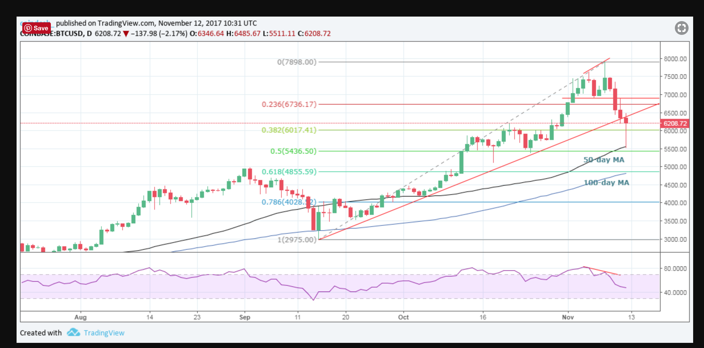

####Price Action of Coin Bit

##### Week ending 12/03/17 (sunday) price action
```
+ it seems 10-day MA is touched at least for every 10 days ( if you count days from last touch of price to 10-d MA line)
+ try with above same with 20-d MA line
+ good,  5d, 10d, 50d MA lines with Volume and RSA to keep big picture

+ try last 3 years code, how many days it took to touch 5d, 10d , 20d MA line of price action ( use Kaggle data and Panda code we have)
```


##### Nov 12, Post segwit2 sell Off : [Flimsy Floor? Bitcoin Charts Suggest Price Decline In Play](https://www.coindesk.com/bitcoin-price-drops-6000-will-find-floor/)

Case I: Rally from July low to September high <br>
Case II: Rally from April low to June high <br>



